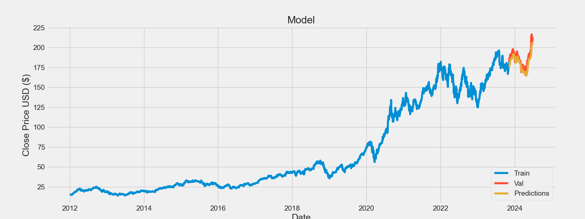

Ik investeer graag in aandelen. Ik breid maandelijks mijn portfolio uit, welke bestaat uit de volgende bedrijven:

1. Alibaba
2. Alphabet Inc. (Google)
3. Berkshire Hathaway (Zowel A als B)
4. Ahold Delhaize

Mij leek het best een goed plan om, als Data Science & AI student, mijn expertise in machine learning te gebruiken om te kijken hoe dit portfolio misschien wel zou uitgroeien.

Dus, bij deze: mijn attempt om analyse van stocks uit te voeren.

Methode: LSTM.

Resultaat:

Geïnspireerd door:
https://www.kaggle.com/code/faressayah/stock-market-analysis-prediction-using-lstm

Discussion:
